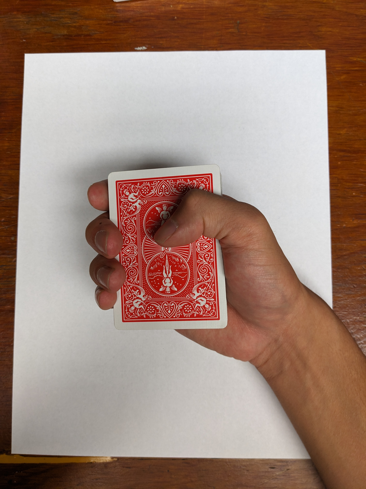
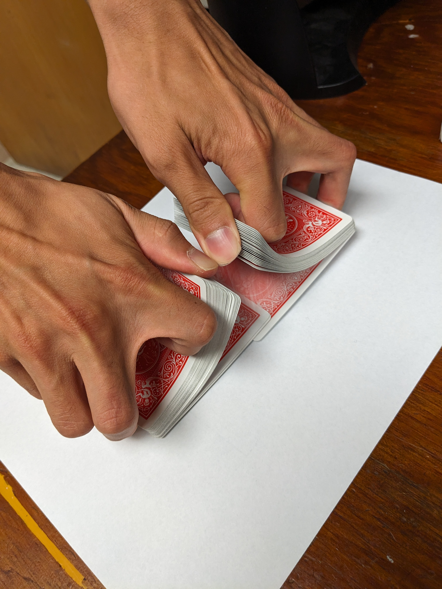
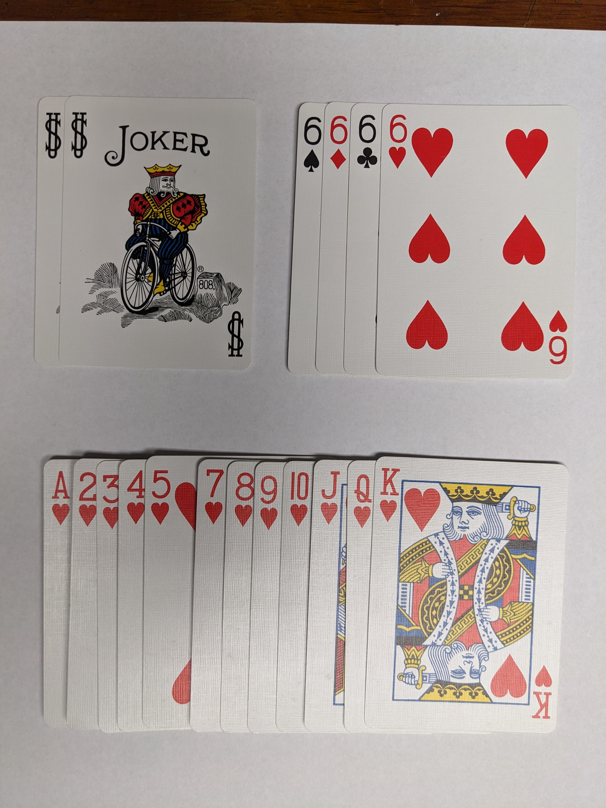
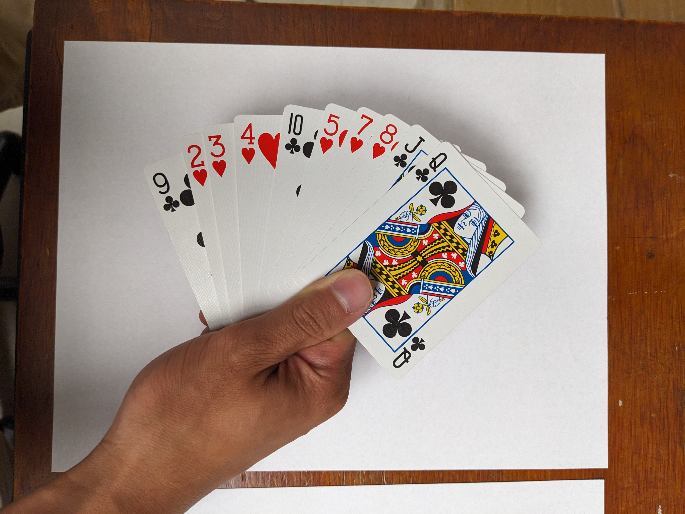
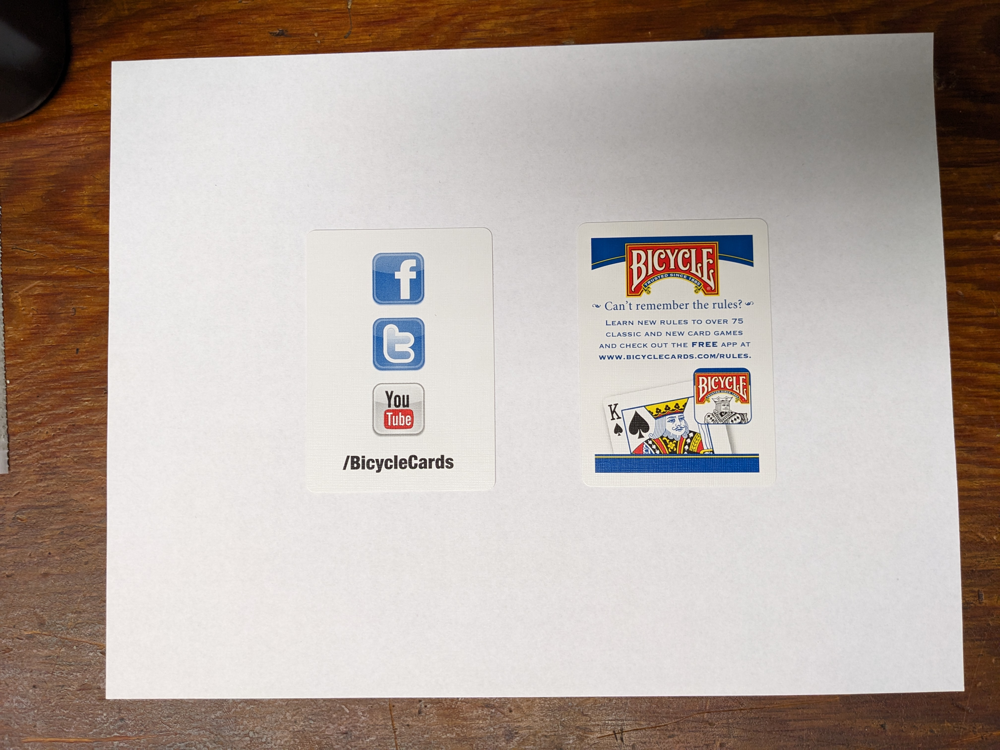
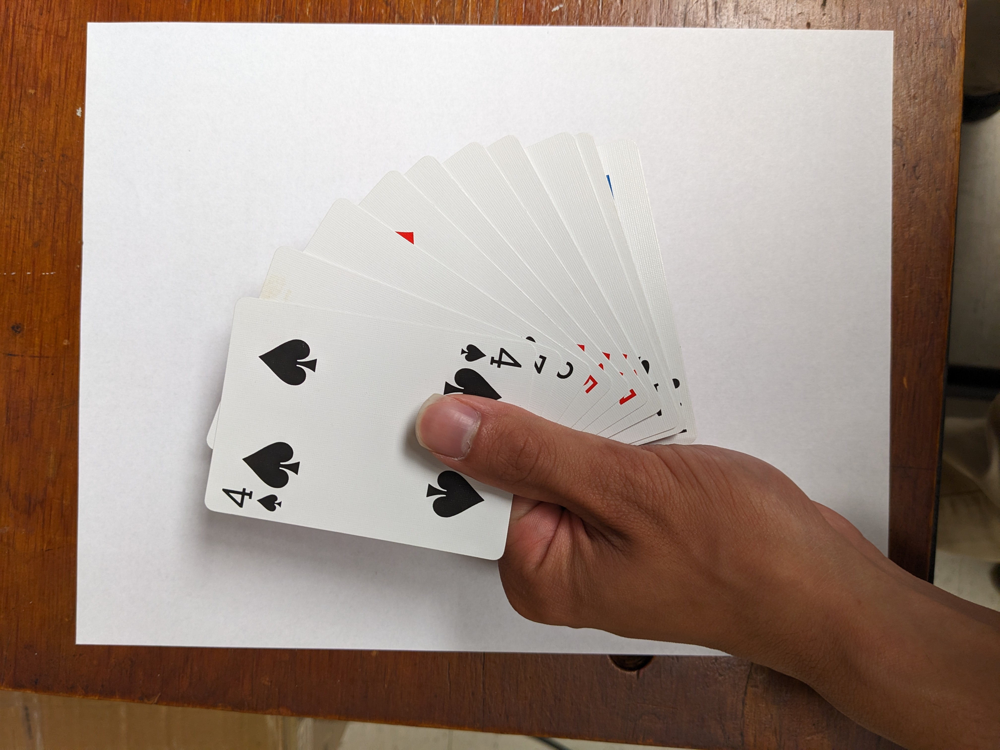
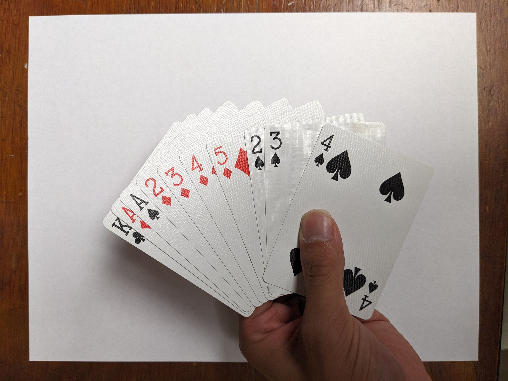

# First Journal Entry: Bicycle Playing Cards

This Journal Entry refers to the usage of the playing cards for a presentation at MBARI: [MBARI Presentation Link](https://vimeo.com/1001218018)

There are many ways that playing cards can be used in the case that I am observing is respect to using them in a presentation. But, fundamentally the cards need to be able to be used by hand and read for their value.

Most interactions by hand are various methods of shuffling, dealing, and fanning the cards. All of these cases have been accounted for in the provided example:

- **Shuffling:** Before the presentation the cards were shuffled before the audience to ensure that the numbers used for the presentation have not been determined before hand.
- **Dealing:** After shuffling the cards they were dealt to members in the audience to hold onto for the demonstration later in the presentation.
- **Fanning:** This is used during the presentation both in the audience as well as a presenter to present the cards to self as well as to the audience.

As a presenter I found it useful that on average the cards fit within the palm of many people. Therefore, a convienient size to share with various people in the audience regardless of the size of their palms.

Additionally, when the cards need to be read there is the need to be able to understand the value of the cards such as:

- Suit: Heart, Diamond, Spade, Clover
- Value: Ace, 2, 3, 4, 5, 6, 7, 8, 9, 10, Jack, Queen, King, Joker

This is well communicated to the audience in the unique designs for each card in addition to the printed value on the Upper Left and Lower Right Conners of the cards the rotational symmetry in the cards themselves is helpful in further aiding in ensuring the orientation is in a readable position, since there are 2 degrees of symmetry. Readable design is further conveyed with using both a symbol and character, represention in the cards, and color contrast with red and black with the opaque white background allow for easier reading. Furthermore, since the design is familiar with many people it can be communicated to other people who are familar with a standard 52 playing card deck.

The paper the cards are printed on also contributes to the experience due to the thickness and design. With the thinness of the paper it is able to be flexed for shuffling, but still thick to be able to be use for a long time without absorbing moisture or tearing after use. Additionally, the air cushion finish between individual cards allow for ease of use while handling cards. This is especially useful since the cards have been used before hand for playing other games.

For those who are not interested in the promotional detials they are additional cards and can be discarded.

There is a difficulty, however if a user is left handed. When the cards are handled by a left-handed user they are unable to fan outward like how a right-handed user is able to (in respects to the direction the thumb moves relative to the body of the user). This is due to the printing on the cards there is the inability to be able to read the card values since the card values are on the top left and the visible corner for a left-handed user is the top-right. In this regard the best that can be done is for the user to fan the cards inward rather than outward. In this case everyone was able to interpret the cards, therefore the goal for using the cards has been accomplished.

